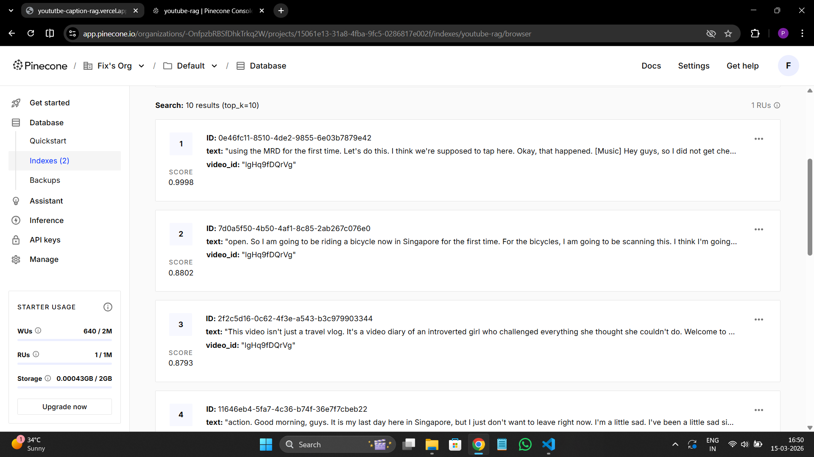
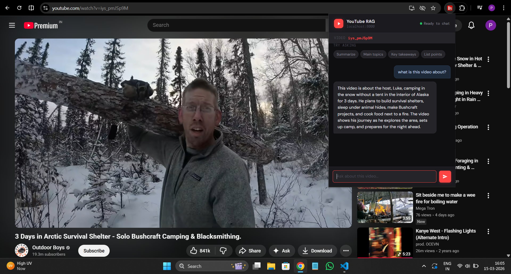

# YouTube RAG — Chrome Extension + FastAPI Backend

Chat with any YouTube video using AI. The extension auto-detects the video
you're watching, indexes it in Pinecone, and lets you ask questions via a popup.

🌐 **Live API:** [yoututbe-caption-rag.vercel.app](https://yoututbe-caption-rag.vercel.app)

---

## Demo

### Screenshots

| Indexing Video | Asking a Question |
|:---:|:---:|
|  |  |

### Video Demo

[▶ Watch screen recording](outputs/screen-capture-RAG.webm)

---

## Project Structure

```
youtube_rag/
├── config.py          # API keys and settings
├── transcripts.py     # Fetch + split YouTube transcripts
├── vectorstore.py     # Pinecone setup and indexing
├── retriever.py       # Retrieval logic
├── chain.py           # LLM + RAG chain
├── main.py            # CLI entry point (optional)
├── server.py          # FastAPI backend (deployed on Vercel)
├── outputs/           # Screenshots and demo video
└── extention/
    ├── manifest.json
    ├── popup.html
    ├── popup.js
    ├── content.js
    └── icons/
        └── image.png
```

---

## Setup

### 1. Install Python dependencies

```bash
pip install -r requirements.txt
```

### 2. Configure API Keys

Create a `.env` file in the root directory:

```env
GOOGLE_API_KEY=your_key
GROQ_API_KEY=your_key
PINECONE_API_KEY=your_key
```

> The backend is already deployed at [yoututbe-caption-rag.vercel.app](https://yoututbe-caption-rag.vercel.app).  
> You only need to run it locally if you want to develop or self-host.

### 3. Load the Chrome Extension

1. Open Chrome and go to: `chrome://extensions`
2. Enable **Developer mode** (top-right toggle)
3. Click **Load unpacked**
4. Select the `extention/` folder

> The extension is pre-configured to talk to the live Vercel backend — no local server needed.

---

## How to Use

1. Go to any YouTube video: `https://www.youtube.com/watch?v=VIDEO_ID`
2. Click the extension icon in your Chrome toolbar
3. If the video isn't indexed yet → click **"⚡ Index This Video"**
4. Wait for indexing to complete (10–30 seconds)
5. Ask any question about the video!

---

## API Endpoints

Base URL: `https://yoututbe-caption-rag.vercel.app`

| Method | Endpoint             | Description                     |
|--------|----------------------|---------------------------------|
| GET    | `/`                  | Health check                    |
| GET    | `/status/{video_id}` | Check if video is indexed       |
| POST   | `/index`             | Index a video (skip if exists)  |
| POST   | `/chat`              | Ask a question about a video    |

---

## Self-Hosting (Optional)

If you want to run the backend locally:

```bash
uvicorn server:app --reload --port 8000
```

Then update the API base URL in `extention/popup.js` to `http://localhost:8000`.

To deploy your own instance on Vercel, push the repo and set the environment variables (`GOOGLE_API_KEY`, `GROQ_API_KEY`, `PINECONE_API_KEY`) in your Vercel project settings.

---

## Notes

- Works with any YouTube video that has captions/subtitles enabled
- Videos only need to be indexed once — subsequent visits skip re-indexing
- Free Pinecone tier supports hundreds of videos in one index
- The live backend is stateless; all vector data is persisted in Pinecone
